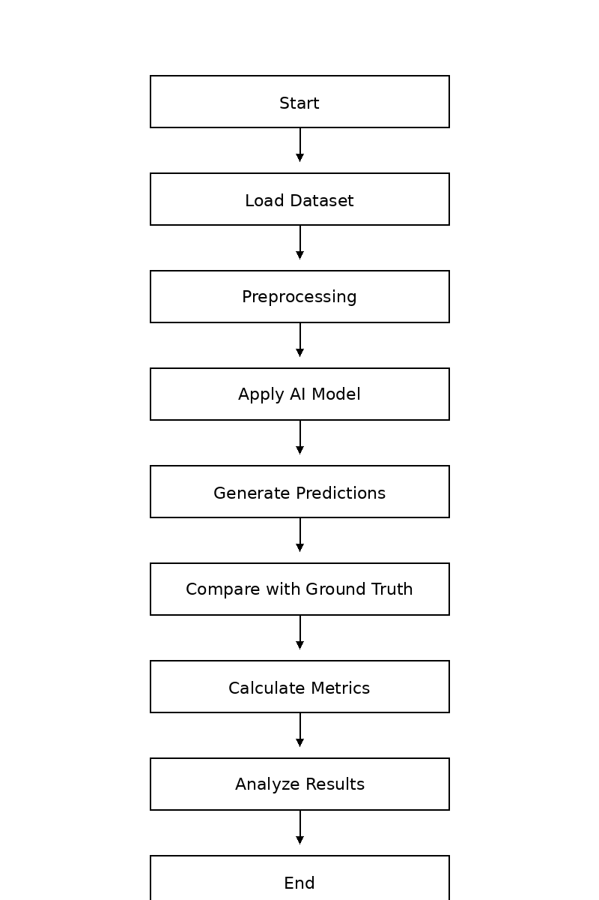
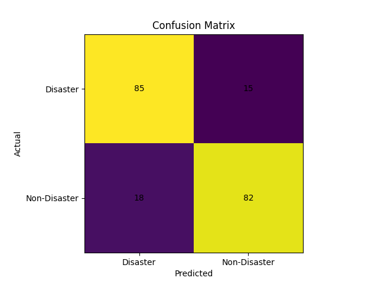
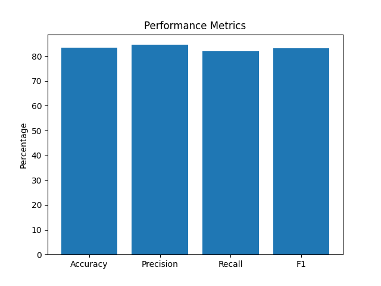

# AI-Based Disaster Response Evaluation System

## 📖 Project Overview
This project focuses on evaluating the performance of AI-based disaster response systems using a comprehensive set of evaluation metrics.

Traditional AI systems are evaluated using accuracy-based metrics, but in real disaster scenarios, additional factors such as response time, missed detections, and reliability are critical.

---

## 🎯 Objective
To design and implement a framework that evaluates disaster response systems using:

- AI Performance Metrics
- System Performance Metrics
- Disaster-Specific Metrics

---

## ⚙️ Methodology
1. Load dataset (simulated disaster data)
2. Generate predictions
3. Compare predictions with ground truth
4. Calculate performance metrics:
   - Accuracy
   - Precision
   - Recall
   - F1-Score
5. Visualize results using graphs

---
## 🔄 System Workflow

---

## 📊 Results

## 📊 Output Screenshots

### Confusion Matrix

### Performance Metrics Graph

---

## 📈 Key Insights
- High accuracy does not guarantee effective disaster response
- Recall is critical as missed detections can be dangerous
- Additional evaluation metrics are required for real-world deployment

---

## 🛠️ Technologies Used
- Python
- NumPy
- Matplotlib
- Scikit-learn

---

## 🚀 Future Scope
- Real-time deployment using drones
- Integration with live disaster datasets
- Web-based dashboard for monitoring

---

## 🔗 Author
K. Keerthi Sri
